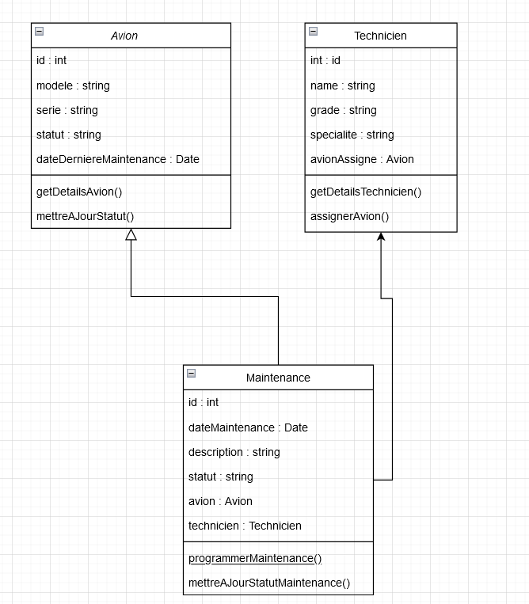

# TP - Création de son API

## Travail à Réaliser

### 1. Conception d'architecture

#### 1.a. Modèle conceptuel/physique de données

#### 1.b. Liste des Endpoints

| **Méthode**           | **Endpoint**                      | **Description**                                 |
|-----------------------|-----------------------------------|-------------------------------------------------|
| `GET`                 | `/api/avions`                     | Récupérer tous les avions.                      |
| `GET`                 | `/api/avions/:id`                 | Récupérer un avion spécifique.                  |
| `POST`                | `/api/avions`                     | Créer un nouvel avion.                          |
| `PUT`                 | `/api/avions/:id`                 | Mettre à jour les informations d’un avion.      |
| `DELETE`              | `/api/avions/:id`                 | Supprimer un avion.                             |
| `GET`                 | `/api/techniciens`                | Récupérer tous les techniciens.                 |
| `GET`                 | `/api/techniciens/:id`            | Récupérer un technicien spécifique.             |
| `POST`                | `/api/techniciens`                | Créer un nouveau technicien.                    |
| `PUT`                 | `/api/techniciens/:id`            | Mettre à jour un technicien.                    |
| `DELETE`              | `/api/techniciens/:id`            | Supprimer un technicien.                        |
| `GET`                 | `/api/maintenances`               | Récupérer toutes les maintenances.              |
| `GET`                 | `/api/maintenances/:id`           | Récupérer une maintenance spécifique.           |
| `POST`                | `/api/maintenances`               | Programmer une nouvelle maintenance.            |
| `PUT`                 | `/api/maintenances/:id`           | Mettre à jour le statut d’une maintenance.      |
| `DELETE`              | `/api/maintenances/:id`           | Supprimer une maintenance.                      |

#### 1.c. Liste des erreurs possibles

**400 Bad Request**

**404 Not Found**

#### 1.d Préciser le chemin du dépôt distant 

**https://github.com/Jeeyrr/DEVOIR-ROMEO/tree/main/API**

